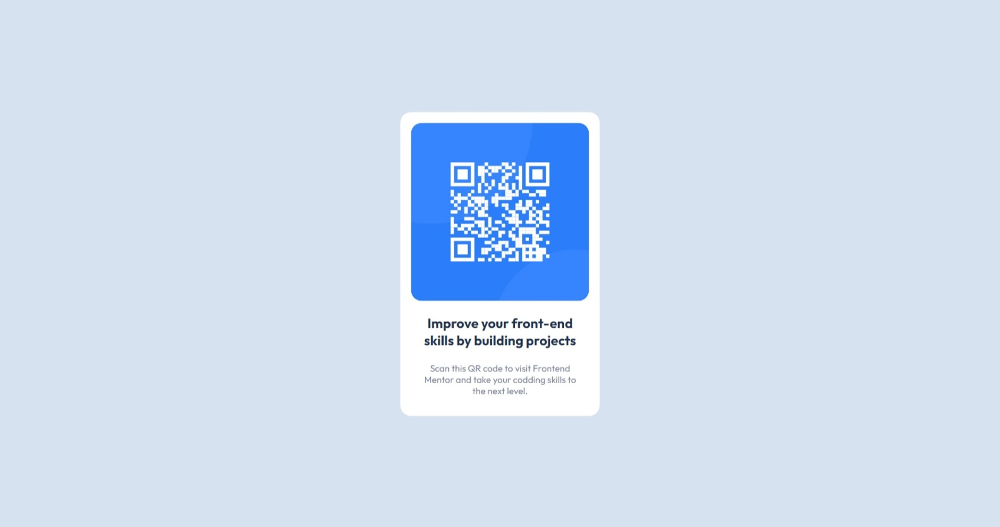

# Frontend Mentor - QR code component solution

This is a solution to the [QR code component challenge on Frontend Mentor](https://www.frontendmentor.io/challenges/qr-code-component-iux_sIO_H). Frontend Mentor challenges help you improve your coding skills by building realistic projects. 

## Table of contents

- [Overview](#overview)
  - [Screenshot](#screenshot)
  - [Links](#links)
- [My process](#my-process)
  - [Built with](#built-with)
  - [Continued development](#continued-development)
- [Author](#author)

## Overview

### Screenshot

### Links

- Solution URL: [Github](https://github.com/akhil-sharma/QRCodeComponent)
- Live Site URL: [https://akhil-sharma.github.io/QRCodeComponent/](https://akhil-sharma.github.io/QRCodeComponent/)

## My process

### Built with

- Semantic HTML5 markup
- CSS3
- Flexbox

### Continued development

I want to focus more on individually targeting different devices using the media queries. I have not used them in this project and rely on relative units like rem. 

## Author

- Website - [Akhil Sharma](https://github.com/akhil-sharma)
- Frontend Mentor - [@akhil-sharma](https://www.frontendmentor.io/profile/akhil-sharma)
